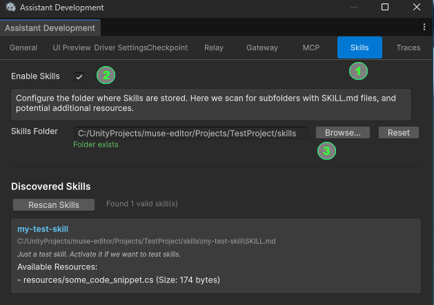
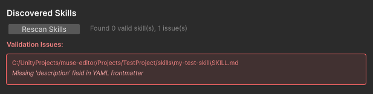
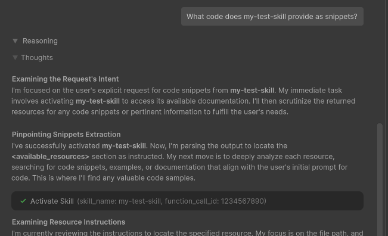

# Skill Development

## Introduction

The following document introduces the steps to locally develop skills, test them, and maintain them in your own repository or package workflow.

* [Workflow Option #1 - Skills Added Via Filesystem](#filesystem)
* [Workflow Option #2 - Skills Added Via C# API Calls](#csharp-api)
* [Testing Skills: User Interface and Skill Activation](#testing-skills)
* [Best Practices / Deployment of Skills](#deployment)

### Project Setup

The following steps add the package and optional development tooling needed to experiment with skills in the Editor:

1. Clone this repository or make the package available locally through a folder reference.
2. In the Unity project that you want to use for developing skills, add `com.unity.ai.assistant` as a local package.
3. If you also have access to a compatible `Unity.AI.Assistant.DeveloperTools` package, add that package as well to enable the development UI described later in this guide.

This fork does not ship a sample `TestProject`, so use your own Unity project when validating skills locally.

### Set Up Your Integration Assembly

Setup of your package for AI Assistant namespace access.

1. Configure your `.asmdef` file with appropriate name and references: Refer to `Unity.AI.Assistant.Runtime`
2. Add internal visibility by modifying `AssemblyInfo.cs` to include your assembly in the following assembly:
   - `Packages/com.unity.ai.assistant/Runtime/AssemblyInfo.cs`

```csharp
[assembly: InternalsVisibleTo("Unity.AI.Assistant.Integrations.Sample.Editor")]
```
> **Note:** In the line above, replace `Unity.AI.Assistant.Integrations.Sample.Editor` with your assembly name.

<a id="filesystem"></a>
## Workflow Option #1 - Skills Added Via Filesystem

Note: This is the preferred and easier way to develop skills simply based on files, especially, if a `SKILL.md` file and optional resources are developed to be added to other existing AI Assistant skills. We store those skill files in one git repository.

### Skill File Preparation

Choose a folder to place your skills in. As a default our UI will choose an initial `skills` subfolder in your current project, still, you may want to change it as a local user preference to any local filesystem path.

A skills development folder may start with just one skill. The standard is to organize them in subfolders:

```
skills
└─ my-test-skill
   ├─ SKILL.md     // main skill file (YAML frontmatter header and skill markdown with instructions)
   └─ resources
      └─ some_code_snippet.cs
```

An example of a SKILL.md file, also referring explicitly to the resource:

```md filename="SKILL.md"
---
name: my-test-skill
description: Just a test skill. Activate it if we want to test skills.
required_packages:
  com.unity.2d.tooling: >=1.0.0
---
### Test Skill Instructions

For general activation of this skill, just output "The test skill `my-test-skill` is running properly."

The user may ask about the resource in general or the C# script at this path:  resources/some_code_snippet.cs
```

Details:

**The header** of the `SKILL.md` file starting and ending with `---` is a standard YAML frontmatter format. The name and description are mandatory to allow the use of a skill.

Optional header fields are:

- `required_packages`: one or multiple lines with a mapping (dictionary) of packages with a specific version, so that this skill only activates if those packages are installed

### Skill File Loading

The files are loaded implicitly during static initialization (Editor startup and domain reloads).

To validate skill loading and reload skills on demand:

Refer to the section below, [Testing Skills: Tool User Interface and Skill Activation](#testing-skills).

<a id="csharp-api"></a>
## Workflow Option #2 - Skills Added Via C# API Calls

Note: This way to add skills may be useful if you conditionally add skills from C# code or dynamically change any details. For most skills, filesystem-based development is simpler and easier to review.

Skills can be defined and added at any time. Since we have to deal with **Domain Reloads**, we add a skill here via C# code during static initialization.

Here is an example of defining and adding a skill:

```csharp
[InitializeOnLoadMethod]
static InitializeSkill()
{
    // Create a new skill definition with all mandatory fields
    var testSkill = new SkillDefinition()
        .WithName("test-skill-with-weather")
        .WithDescription("A test skill to gather some location and weather info, suggesting activities.")
        .WithTag("Skills.TestTag") // Allows also to remove this again, via SkillsRegistry.RemoveSkillsByTag("Skills.TestTag")
        .WithContent(@"
            You are a friendly personal assistant. Use your tools to:
            1. Suggest activities based on the weather
            2. Categorize at least into leisure, sports, cultural, and food.

            Some general information is stored here as a resource: `resources/activity_ideas.md`                  
        ")

        // Optional data, here we use a resource 
        .WithResource("resources/activity_ideas.md", new MemorySkillResource(@"## Things To DO depending on weather:
            In Montreal, Canada, warm weather activities include: hiking, visiting a park, outdoor sports, having a picnic, going to a terrace, etc.
            In Paris, France, general activities include: visiting the Louvre, going to a restaurant.
            In New York, USA, warm weather activities include: a Manhattan tour, outdoor sports, going to a rooftop location for nice photos, etc. Cold weather activities include: visiting a museum, going to a restaurant, going to the movies, etc.
            In London, UK, warm weather activities include: going to a terrace, going to outdoor markets including Camden Lock, etc. Cold weather activities include: visiting a museum (many are free), going to a pub, etc.
        "))
        // ...and a set of tools (a set of methods with [AgentTool] attribute in class `SampleTools`)
        .WithToolsFrom<SampleTools>();

    // From here on the skill is available to the backend, to be tested and used
    SkillsRegistry.AddSkills(new List<SkillDefinition> { testSkill });
}
```

If we dynamically add a skill and use it only temporarily we can also remove it from the set of AI Assistant skills.

Note: Skills added on the frontend are only refreshed for **each new chat**. Removal here doesn't work during an ongoing chat.

```csharp
SkillsRegistry.RemoveByTag("Skills.TestTag");
```

<a id="testing-skills"></a>
## Testing Skills: User Interface and Skill Activation

With your project opened, access the development tool through the Editor menu option `AI Assistant > Internals > Assistant Development` if the optional developer tools package is installed.

In the Assistant Development window:

1. Select the `Skills` tab
2. Check the `Enable Skills` option
3. Change your local skill development folder, if desired

The **"Rescan Skills" button** can be clicked at any time to rescan and reload skills from the filesystem. They are available and used by the backend when a new chat is started.



### Skill Validation via Skill UI

The skill details are presented as shown in the image above, under **Discovered Skills**.

We list each valid skill's mandatory name and description. The `SKILL.md` path is listed, for skills we added via the filesystem (above mentioned as Workflow Option 1).

Optional displayed details:

**Available Resources** from subfolders, if any, are listed to confirm that the files exist and are provided to the backend **on demand**.

**Required Packages**, if any, are listed as package name and version.

Note: Listing resources here does **not** validate that they are used correctly in `SKILL.md`. It is up to the user to verify relative paths in the `SKILL.md` or to remove unused files. In our example skill folder structure above, the `SKILL.md` might reference `resources/some_code_snippet.cs`.

**Formatting Issues:** If there are issues with the file content, you may instead see error messages visualized.



### Skill Activation

**Skill Activation** refers to **actually using skills** as part of AI Assistant reasoning and actions.

To confirm activation, we start using the skill in a prompt, e.g. simply ask about its content (markdown and/or resources).

Look for the following feedback to confirm skill activation:

1. **The AI Assistant conversation's tool UI** should confirm the skill use under **Thoughts**, by stating **"Activate Skill"** and a `skill_name` parameter with your skill's name, like in this example:



2. **The Console**, with internal logging activated, logs each skill access as `Calling tool: Unity.Skill.ReadSkillBody` when accessing the `SKILL.md` file, with a `skill_name` parameter stating your expected tool name. If resources are accessed, the log shows `Calling tool: Unity.Skill.ReadSkillResource` again with your `skill_name` parameter and a `resource_path` parameter stating the accessed resource.

Note: **Internal logging** in the Console window requires the Editor's `Player Settings` section `Player / Other Settings / Script Compilation / Scripting Define Symbols` to contain the value: `ASSISTANT_INTERNAL`. This is already set up in the `TestProject`.

### Prompting from C# Code ###

For semi-automatic tests for example, it is possible to start prompts referring to skills.

See our [Samples](SAMPLE.md) on how to prompt the AI Assistant from C# via the `AssistantApi` (sections `Run with Assistant UI` and `Prompt-Then-Run`). Sample C# code is also [available here](../Sample/ApiExample.cs) including both the definition and invocation of the sample skill above.

<a id="deployment"></a>
## Best Practices / Deployment of Skills

There are subtle ways to write good and robust skills, also for example vague skills that don't generally improve results or aren't reliably chosen by the model as the applicable skill.

**To prepare for deployment:**

Note: We expect most skill work to happen through `SKILL.md` files. For testing and PRs that add skills via the C# API, the review process may differ slightly.

1. **Manual Testing:** Create test cases (prompts and success criteria), verify their success manually, and iterate until the skill behaves as expected.
2. **Staging and Regression Testing:** Stage your changes and run whatever automated checks or regression prompts your team relies on.
3. **Merging:** If validation passes, submit a PR in the repository where your skills are maintained and review it with the appropriate maintainers.
4. **Benchmarking:** Keep a small repeatable prompt suite so you can re-check behavior when models, tools, or prompts change.

### Merging Skill Data (Git Workflow)

This fork does not prescribe a single shared skill repository or backend deployment path.

If your environment loads skills from a separate repository or package:

1. Commit the skill changes to your branch in that repository.
2. Update your local backend or package dependency to point at that branch or local checkout.
3. Validate the skill end to end in the target environment.
4. Submit a PR and merge through your normal review process.

## Further references

For **best practices** and a deeper dive into skill creation, see [Skill Creation Guidelines](SKILL_CREATION_GUIDELINES.md).

It covers also:

- **Tools** that can be called from skills
- **Testing** a skill 
- **Deployment** of new skills in your own repository or package workflow
